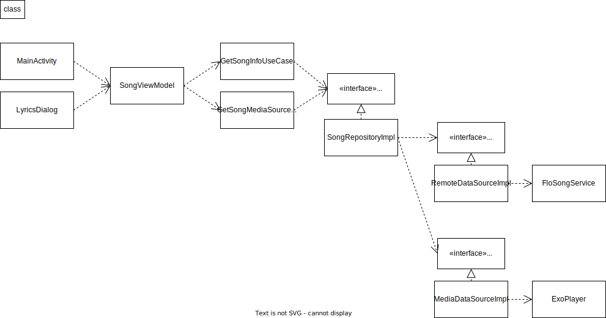

# Flo 앱 개발 챌린지 ✨

프로그래머스에서 진행한 앱개발 챌린지 제출 자료입니다.
136.25점(180점), 상위 2%

## Run test

```bash
$ gradle test
``` 

## 🔍  Overview

프로그래머스에서 진행한 플로 앱 개발 챌린지의 과제로 구현한 음악 플레이어 애플리케이션입니다. 제공되는 API를 통해 음악과 관련된 데이터를 얻고 애플리케이션에서 사용할 수 있는 형태로 가공하여 기능을 구현했습니다. 음악 파일을 재생, 일시정지 하고 가사보기, 가사와 음원의 싱크 기능이 있는 애플리케이션을 제작했습니다.

그러나 구현 중에 서버에서 API를 통해 전달해준 가사 데이터로는 음원과 가상 싱크가 맞도록 하는 기능을 구현하기 어렵다는 문제를 발견하게 되었습니다. API를 통해 전달해준 가사 데이터를 사용하여 변환할 수 있는 포맷을 찾고 exo player에서 해당 포맷을 지원하는지 검토했습니다. 검토한 결과 exo player에서는 SRT 포맷을 지원하고 있었습니다. exo player에서는 포맷 변환 기능은 제공하지 않기 때문에 이를 직접 구현하였습니다. 서버로부터 받은 가사 데이터를 가사 한 줄, 가사의 시작 타이밍, 가사의 종료 타이밍 데이터로 분리하고 SRT 포맷에 맞는 형태로 재구성하여 변환하여 문제를 해결했습니다.

구현 중 부딪히는 문제가 많았지만 포기하지 않으며 요구사항을 모두 충족하는 애플리케이션을 만들어 냈습니다. 그 결과 개발경력 5년 이상, 앱 개발경력 3년 이상을 대상으로 하는 챌린지에서 상위 2%의 성적을 기록할 수 있었습니다.

저는 이 경험을 통해서 못 할 것이라는 생각, 관념을 버리면 어떤 일이든지 해낼 수 있다는 것을 다시 한번 느낄 수 있었습니다. 문제가 생기면 책임지고 해결하려는 자세가 더 높은 수준으로 저를 성장시킨다는 것을 알게 되었습니다.




## 👀 기획에서 개발까지

저는 처음 경험하는 프로젝트를 이끌어 가고자 먼저 기업이 실제로 서비스하고 있는 음악 플레이어 애플리케이션을 참고했습니다. 애플리케이션을 직접 사용하면서 화면 플로우가 어떻게 되는지, 어떤 인터페이스 요소를 사용하여 기능을 표현했는지 분석했습니다. 분석한 내용을 바탕으로 어도비XD라는 툴을 사용하여 화면 기획하여 프로젝트의 방향성을 잡았습니다. 다음으로 기업의 채용공고를 참고하여 메인이 되는 exo player라는 기술을 프로젝트에 적용하였습니다. 처음 접하는 생소한 기술이기 때문에 먼저 공식 문서를 보며 어떤 기능을 지원하는지 파악했습니다. 그리고 문서에 있는 가이드를 따라 작은 플레이어를 만드는 과정을 연습하고 프로젝트에 적용하였습니다.

## 🛠 사용기술 및 언어

`kotlin` `retrofit` `gson` `koin` `junit` `mockito` `assertj` `glide` `glide-transformations` `rxAndroid` `rxKotlin` `exoPlayer`

## 🧐  스크린샷 및 주요 기능

  

**스플래쉬 화면**

  

**메인 화면**

- 현재 재생되고 있는 구간대의 가사를 **실시간으로 하이라이팅**하여 보여줍니다.
- 음악의 진행 상황을 seek bar로 나타냅니다.
- seek bar를 사용하여 **재생 구간을 설정** 할 수 있습니다.
- 재생중인 음악의 정보를 나타냅니다. (곡명, 아티스트, 앨범 커버 이미지)

  

**가사 다이얼로그**

- 현재 재생되고 있는 구간대의 가사를 **실시간으로 하이라이팅**하여 보여줍니다.
- 터치 모드 On일 경우 **가사를 클릭하면 해당 부분으로 곡의 재생 구간이 이동**합니다.
